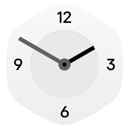
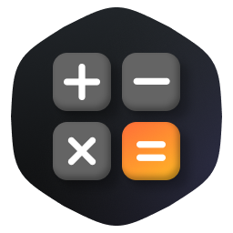

\ifndef{skipblock}Example of KPA package with a Flutter-based GUI application.\endif
---
title: KPA-пакет с программой с графическим пользовательским интерфейсом на базе Flutter
copyright: © \KB_CURRENT_YEAR АО «Лаборатория Касперского».
---

## Обзор примера

Пример демонстрирует сборку KPA-пакета, предназначенного для установки в KasperskyOS. Пакет содержит программу с графическим пользовательским интерфейсом. Для создания графического интерфейса используется фреймворк Flutter, входящий в состав KasperskyOS for Mobile SDK.

> Полученный в результате сборки этого примера KPA-пакет предназначен для установки в готовое решение на базе KasperskyOS, запущенное в эмуляторе или на физическом устройстве. В отличие от примеров, демонстрирующих сборку решения, этот пример не содержит описаний инициализации решения и описаний политики безопасности.

# Состав KPA-пакета

Программа `minimal_flutter`
:   Показывает окно с движущимися изображениями (спрайтами). Каждый спрайт имеет случайное начальное направление движения и скорость. При достижении границы экрана, каждый спрайт меняет направление движения, имитируя отскок упругого объекта от плоской преграды. Отображаемое имя программы локализуется на два языка (русский и английский). Программа имеет значок в формате SVG.

# Сценарий работы программы minimal_flutter

Программа `minimal_flutter`:

1. Создает объект `MaterialApp`.
1. Создает виджет `BouncingImages` наследующий `StatefulWidget`.
1. Создает объект внутреннего состояния виджета `_BouncingImagesState` наследующий `_BouncingImagesState` с добавлением `TickerProviderStateMixin`.
1. Создает `AnimationController`, управляющий анимацией движения спрайтов (изображений из директории `assets`).

Запущенная анимация выполняется, пока пользователь не завершит работу программы.

# Реализация программы minimal_flutter

Исходный код на языке Dart:

<details><summary>lib/main.dart</summary>
```cs
\include{"lib/main.dart"}
```
</details>

Описание зависимостей для фреймворка Flutter:

<details><summary>pubspec.yaml</summary>
```yaml
\include{"pubspec.yaml"}
```
</details>

Изображения (спрайты), использующиеся в анимации (PNG-файлы в директории `assets`):

{width=64}
{width=64}
{width=64}
{width=64}
{width=64}
{width=64}
{width=64}
{width=64}
{width=64}
{width=64}
{width=64}
{width=64}
{width=64}
{width=64}

Файл с локализованными именами программы (эти имена используются как подпись значка программы на рабочем столе):

<details><summary>resources/locale/names</summary>
```txt
\include{"resources/locale/names"}
```
</details>

Значок программы (файл `resources/icons/flutter.png`):

{width=64}

# Сборка

В примере используется система сборки CMake из состава KasperskyOS for Mobile SDK.

`./CMakeLists.txt` – CMake-команды сборки проекта примера:

<details><summary>CMakeLists.txt</summary>
```cmake
\include{"CMakeLists.txt"}
```
</details>

Архитектура сборки зависит от того, какой скрипт вы используете для сборки. В корневой директории примера расположены следующие скрипты:

`./cross-build.x86_64-pc-kos.sh`
:   Скрипт сборки для архитектуры x86-64. В результате работы скрипта будет создан KPA-пакет для установки в эмуляторе KasperskyOS for Mobile.

`./cross-build.aarch64-kos"`
:   Скрипт сборки для архитектуры arm64. В результате работы скрипта будет создан KPA-пакет для установки на устройство KasperskyOS for Mobile.

> Программа, собранная для архитектуры arm64, не может выполняться в эмуляторе KasperskyOS for Mobile. Программа, собранная для архитектуры x86-64, не может выполняться на устройстве KasperskyOS for Mobile.

## Сборка для архитектуры x86-64

*Чтобы собрать пример для запуска в эмуляторе KasperskyOS for Mobile,*

перейдите в корневую директорию примера и запустите скрипт:

```sh
./cross-build.x86_64-pc-kos.sh
```

После успешного завершения сборки, KPA-пакет `lk.minimal_flutter.kpa` для архитектуры x86-64 доступен в директории `./build.x86_64-pc-kos/kpa`.

## Сборка для архитектуры arm64

*Чтобы собрать пример для запуска на устройстве KasperskyOS for Mobile,*

перейдите в корневую директорию примера и запустите скрипт:

```sh
./cross-build.aarch64-kos.sh
```

После успешного завершения сборки, KPA-пакет `lk.minimal_flutter.kpa` для архитектуры arm64 доступен в директории `./build.aarch64-kos/kpa`.

# Установка

## Установка в эмуляторе KasperskyOS for Mobile

*Чтобы установить KPA-пакет в эмуляторе KasperskyOS for Mobile:*

1. Запустите эмулятор KasperskyOS for Mobile.

    ```sh
    kosctl emu start mobile-develop
    ```

    В этой команде, `mobile-develop` -- имя одного из установленных образов KasperskyOS для запуска в эмуляторе. Вы можете использовать команду `kosctl emu list-firmware` чтобы получить список установленных образов.

    > * Эмулятор KasperskyOS for Mobile поставляется в составе KasperskyOS for Mobile SDK. Подробная информация об этом инструменте представлена в *Руководстве разработчика KasperskyOS for Mobile SDK* (раздел "Эмулятор KasperskyOS for Mobile").
    > * Инструмент `kosctl` поставляется в составе KasperskyOS for Mobile SDK. Подробная информация об этом инструменте представлена в *Руководстве разработчика KasperskyOS for Mobile SDK* (раздел "Инструмент kosctl").


2. Запустите установку KPA-пакета в эмуляторе:

    ```sh
    kosctl app install ./build.x86_64-pc-kos/kpa/lk.minimal_flutter.kpa
    ```

    Если у вас запущено более одного эмулятора, или подключено физическое устройство, то укажите имя эмулятора для установки пакета с помощью параметра `-d`.

3. Дождитесь сообщения `Package installed successfully`.

## Установка на устройстве KasperskyOS for Mobile

*Чтобы установить KPA-пакет на устройстве KasperskyOS for Mobile:*

1. Подключите включенное устройство KasperskyOS for Mobile к USB-разъему компьютера.

   > Если вы используете `kosctl` в Windows через слой совместимости Windows Subsystem for Linux (WSL), [используйте утилиту usbipd-win для подключения USB-устройства в WSL](https://learn.microsoft.com/en-us/windows/wsl/connect-usb).

2. Получите список доступных устройств KasperskyOS for Mobile:

    ```sh
    kosctl device list
    ```

3. В выводе предыдущей команды найдите таблицу со списком подключённых физических устройств. Имена обнаруженных устройств отображаются в колонке `NAME`. Скопируйте или запомните имя устройства на котором вы хотите установить KPA-пакет.

4. Запустите установку KPA-пакета на устройстве:

    ```sh
    kosctl app install -d <device> ./build.aarch64-kos/kpa/lk.minimal_flutter.kpa
    ```

    Вместо `<device>` используйте имя физического или виртуального устройства, которое вы скопировали или запомнили на предыдущем шаге.

6. Дождитесь сообщения `Package installed successfully`.

# Запуск

*Чтобы запустить программу из установленного KPA-пакета,*

найдите на главном экране KasperskyOS for Mobile значок программы {width=24 height=24} и нажмите на него.

> Если программа из состава установленного KPA-пакета не запускается, убедитесь, что вы установили KPA-пакет с правильной архитектурой сборки.

# Удаление

*Чтобы удалить KPA-пакет в эмуляторе или на устройстве KasperskyOS for Mobile:*

1. Получите список подключенных эмуляторов/устройств:

    ```sh
    kosctl device list
    ```

2. Удалите KPA-пакет:

    ```sh
    kosctl app uninstall lk.minimal.flutter -d <device>
    ```

    Вместо `<device>` используйте имя устройства, на котором нужно удалить пакет.

3. Дождитесь сообщения `Package uninstalled successfully`.

Если программа из состава удаляемого KPA-пакета запущена на момент удаления, она будет остановлена и затем удалена.

# Информация о стороннем коде

Информация о стороннем коде содержится в файле `legal_notices.txt`, расположенном в директории установки SDK.

# Уведомления о товарных знаках

Зарегистрированные товарные знаки и знаки обслуживания являются собственностью их правообладателей.

Arm
:   Зарегистрированный товарный знак Arm Limited (или дочерних компаний) в США и/или других странах.

Dart, Flutter
:   Товарные знаки Google LLC.

Linux
:   Товарный знак Linus Torvalds, зарегистрированный в США и в других странах.

Windows
:   Товарный знак группы компаний Microsoft.
